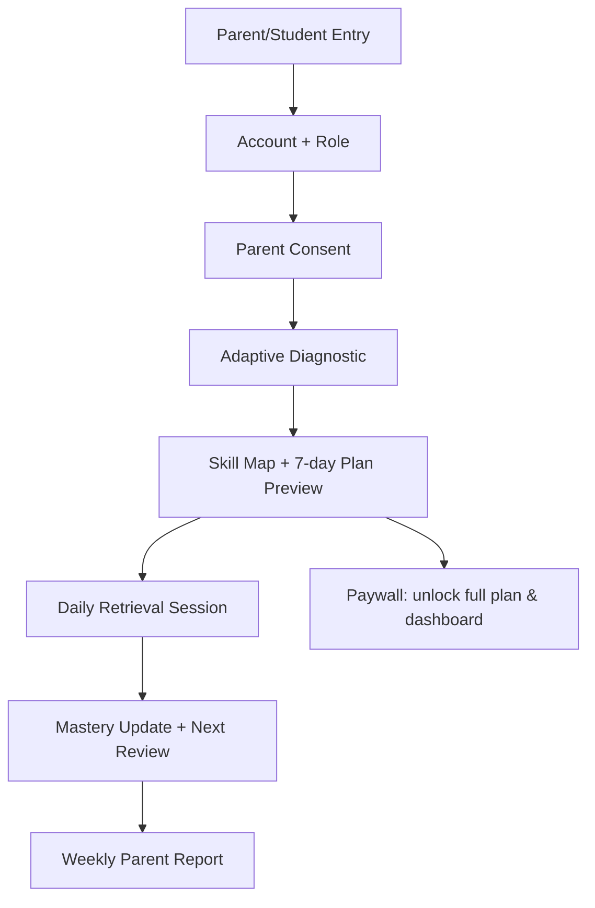

# 0) Cover Page

**Project:** **aiventa** — Kazakhstan-first personalized learning platform (minors-first)
**Version/Date:** v1.0 — March 3, 2026 (Asia/Almaty)
**One-line positioning:** _Goal-anchored, mastery-based learning that replaces “random studying” with an adaptive plan tied to real outcomes (UNT/career), built with child-safety and privacy by design._ [D1 | glm.md | Competitive Moat / Goal-Anchored Learning]

**Evidence status (approx, for this document):**

- **Verified:** ~25% (Kazakhstan macro stats, some competitor/market anchors, key constraints)
- **Assumptions:** ~55% (pricing bands, unit economics ranges, KPIs, timelines)
- **Unknown (needs evidence):** ~20% (true WTP, funnel conversion, exact competitor pricing/features, local consent thresholds)

(These percentages are computed qualitatively from the Evidence + Assumptions tables included in Appendices A/B.) [D5 | qwen.md | Validation Checklist]

---

# 1) Executive Summary (1–2 pages)

## The Big Bet (what we’re building and why it wins)

**aiventa** is a **diagnostic-first + spaced-repetition mastery system** that produces a personal learning plan in minutes, then keeps learners on track with short daily retrieval practice and mastery gates—**without dark patterns** and with **parent-visible trust controls**. [D2 | gpt.md | Core Loop + minors-safe motivation]

**Differentiating wedge/moat:** **Goal-Anchored Learning**: connect a learner’s **career/goal** (from your existing proforientation asset) to the **exact prerequisite skills** they must master, converting “why am I learning this?” into a persistent motivation loop competitors struggle to copy. [D1 | glm.md | Product Architecture: Goal-Anchored Learning]

## Who it’s for (segments) + core outcome

Primary segments (Kazakhstan-first):

- **S1 UNT preppers (15–17)** + **S2 parents as payers** as initial wedge. [D1 | glm.md | Segment Architecture]
- Expansion: **core K-12**, plus **teachers/schools** as B2B2C distribution. [D1 | glm.md | Segment Architecture]

Core outcome (MVP target): **measurable mastery gains + improved exam readiness** with parent-visible progress intelligence. _(Assumption; must be proven with pilots.)_

## Why now (trends + Kazakhstan fit)

- **Internet penetration ~92.9%** (docs cite DataReportal) enabling digital learning reach. [D1 | glm.md | Digital Readiness]
- **Private tutoring is common** (71% of Grade 6 Astana students in a cited peer-reviewed study via docs), creating a clear “tutor substitution” narrative. [D5 | qwen.md | Context Digest]
- **Regulatory constraint:** targeted ads to minors are restricted; business model must avoid kid-targeted advertising and lean subscription/B2B. [D1 | glm.md | Regulatory Reality]

## Business model snapshot (how we make money)

- Primary: **parent-paid B2C subscription** (monthly/quarterly/annual), plus **optional exam sprint packs** (non-manipulative, clearly optional). [D2 | gpt.md | Monetization Architecture]
- Year 2+: **school licensing** (B2B2C) and teacher tools. [D4 | preplexity.md | B2B licensing]
- Later: vetted tutoring marketplace (high compliance overhead; defer). [D4 | preplexity.md | Tutoring marketplace]

Pricing anchors must be reality-based: docs cite **Bilimland** examples (**4490 ₸ / 90 days**, **14290 ₸ / year**) as an anchor. [D2 | gpt.md | Bilimland anchor]

## Buildability snapshot (architecture + timeline)

Selected architecture: **aiventa Hybrid Modular Monolith → Microservices** (ship fast as a modular monolith; evolve into the microservices topology shown in qwen.md when scaling demands it). [D5 | qwen.md | System Architecture Overview]

MVP (0–90 days) ships:

- adaptive diagnostic + skill map
- spaced plan generator
- retrieval practice engine
- parent dashboard
- Kaspi/card payments _(exact rails depend on your integrations; assumption)_

Roadmap framing is consistent across docs (90/180/365) and is adopted here. [D3 | grok.md | MVP→V1→V2]

## Top 10 risks + mitigations (bullets)

1. **Child safety incident** → no DMs/public profiles; moderation + parent tools; incident playbook. [D4 | preplexity.md | Risk Register]
2. **AI hallucinations harm learning** → “hint-first”, canonical checks, human review queue, stop rules. [D4 | preplexity.md | Hallucination mitigation]
3. **Diagnostic errors create wrong paths** → calibrated item bank + expert review, continuous evaluation. [D4 | preplexity.md | Product & technical risks]
4. **Regulatory tightening** → conservative design now; consent tracking; data minimization. [D3 | grok.md | Risk Register]
5. **Unknown WTP** → Van Westendorp pricing survey; A/B pricing tests. [D5 | qwen.md | Validation checklist]
6. **CAC too high** → prioritize organic loops (teacher/parent share), not kid-targeted ads. [D3 | grok.md | Growth loops constraints]
7. **Churn** → spaced repetition + goal anchoring + parent weekly report. [D4 | preplexity.md | Engagement drops mitigation]
8. **Competitor response** → move fast on knowledge graph + goal bridge; verify competitor truth via mystery shopping. [D2 | gpt.md | Contradictions / need verification]
9. **Content operations cost/time** → hybrid: start with limited subjects/grades; expand after efficacy proof. _(Assumption; see roadmap.)_
10. **Unit economics fail** → explicit Day-90 go/no-go gates and kill criteria. [D5 | qwen.md | Go/No-Go + kill criteria]

---

# 2) Problem, Users, and Jobs-to-be-Done

## Segments (Kazakhstan-first)

From docs, five primary segments (with roles) are defined; aiventa prioritizes **S1 + S2** first. [D1 | glm.md | Segment Architecture]

- **Kids/teens (primary users):** need mastery + exam readiness; constraints include device variability and school norms. [D1 | glm.md | Digital readiness + device heterogeneity]
- **Parents (buyers/monitors):** want proof, transparency, and safer alternative to expensive tutoring. [D1 | glm.md | Parents JTBD/WTP]
- **Teachers/schools (channels):** cohort insights without increasing workload (B2B2C). [D1 | glm.md | Schools segment]

## JTBD (Jobs-to-be-Done) per segment

### Teens (UNT wedge)

- **Job:** score high efficiently (grant threshold / admission) and avoid wasted study time. [D1 | glm.md | S1 JTBD definition]
- **Pain:** tutors are expensive/unstructured (in docs); content apps don’t adapt. [D1 | glm.md | S1 pain]

### Parents (payers)

- **Job:** replace “blind spending” on tutoring with measurable mastery and progress alerts. [D1 | glm.md | Parent dashboard + gap alerts]

### Teachers/schools

- **Job:** class gap analysis + assignments; evidence of improvement. [D1 | glm.md | Teacher dashboard concept]

## Constraints (non-negotiable)

- **Minors-first:** no manipulative UX; parent-gated sharing; safety controls. [D3 | grok.md | Constraints]
- **Privacy-by-design:** minimal PII; consent tracking; retention policy. [D4 | preplexity.md | Consent model]
- **Ads restrictions:** avoid kid-targeted ads; subscription/B2B orientation. [D1 | glm.md | Regulatory reality]

---

# 3) Market & Competitive Landscape (Kazakhstan-first; expandable)

## Verified market facts (from provided docs)

- Kazakhstan population **~20.7–20.9M**; **K-12 students ~3.82–3.90M** (docs attribute to stat.gov.kz). [D5 | qwen.md | Context Digest]
- **EdTech market 2024: ₸95.4B** total; children’s segment **+76% YoY** (docs attribute to TAdviser). [D5 | qwen.md | Context Digest]
- **Private tutoring prevalence** (71% in cited study via docs) supports “tutor substitution” positioning. [D5 | qwen.md | Context Digest]

## Competitor map (ONLY what docs assert; treat pricing/features as “verify”)

Docs list key competitors and reach (needs verification where not primary-sourced in the pack):

- **Kundelik (~6,500 schools)**, **BilimLand (2M+ users)**, **Qalan** and **JUZ40** with revenue figures cited in docs. [D5 | qwen.md | Context Digest]
- Competitor facts vary across documents; **treat competitor pricing/features as “needs mystery shopping”**. [D2 | gpt.md | Contradictions]

## Differentiation + wedge strategy

- Don’t fight a “content war” (BilimLand). Fight an **outcome war vs private tutors**: better outcomes with measurable mastery at a fraction of tutoring cost. [D1 | glm.md | Strategic pivot]

## Moat hypothesis (labelled)

- **Moat hypothesis (Assumption):** the combination of (1) diagnostic mastery graph, (2) spaced repetition engine, and (3) career-goal anchoring creates a compounding personalization asset and distribution edge via your existing proforientation funnel. [D1 | glm.md | Goal-Anchored Learning]
  Validation: run funnel experiment and measure conversion lift from proforientation traffic. [D5 | qwen.md | Validation checklist: proforientation conversion]

---

# 4) Product Strategy & Positioning (CPO lens)

## Positioning statement + category design

**aiventa** = “**Mastery Coach**” (not a video library, not a chatbot, not just exam drills):

- **Diagnose** what you know
- **Plan** what to do next
- **Practice** via retrieval
- **Prove** mastery
- **Explain** (hint-first)
- **Repeat** (spaced)

This mirrors the “learning core loop” described in docs. [D2 | gpt.md | Core Loop]

## Core promise + “why trust us”

- **Trust pillar 1:** Parent-visible progress intelligence (not vague “time spent”). [D1 | glm.md | Mastery dashboard + gap alerts]
- **Trust pillar 2:** Safety-by-design (no uncontrolled social surfaces). [D2 | gpt.md | Risks: uncontrolled social features]
- **Trust pillar 3:** “Hint-first” tutoring policy to prevent “answer vending.” [D2 | gpt.md | Tutor constraints]

## North Star metric + KPI tree

**North Star (Assumption):** “Weekly mastered skills per active learner” (with retention guardrail).
KPI tree (initial, Assumption):

- **Activation:** diagnostic completed → first plan generated
- **Learning:** mastery delta (pre/post micro-assessments)
- **Retention:** weekly active learners; plan adherence
- **Conversion:** trial→paid; annual plan adoption
- **Safety:** critical incidents = 0; moderation latency; policy violation rate

Docs propose KPI trees and stop rules; adopt that discipline. [D3 | grok.md | KPI tree + stop rules]

## Product principles (learning science + safety + simplicity)

- Retrieval practice + immediate feedback (Mechanism referenced in docs). [D2 | gpt.md | Retrieval practice engine]
- No shame loops: avoid public comparison and high-pressure leaderboards. [D2 | gpt.md | Avoid over-competitive mechanics]
- Ethical monetization: transparent, refundable, parent-held payments. [D4 | preplexity.md | Ethical constraints + payment infra]

---

# 5) User Journeys & Flows (Screens + States)

## 5.1 B2C onboarding → personalization → learning loop → progress → upsell

### Flow (step-by-step states)

1. **Landing (Parent-first entry option)**
   - Value: “Replace tutoring uncertainty with mastery proof.” _(Assumption copy)_

2. **Account creation**
   - Role selection: Parent / Student

3. **Consent checkpoint (minors)**
   - Parent consent checkboxes for learning data + reports + analytics; opt-out allowed. [D4 | preplexity.md | Consent model]

4. **Diagnostic (5–7 min, adaptive)**
   - Output: skill map + “next 7 days” plan preview. [D2 | gpt.md | Core loop: diagnose/plan]

5. **Plan generation (spaced schedule)**
   - Shows daily minutes + goals; no infinite scroll. _(Assumption UX)_

6. **Daily session**
   - Retrieval questions → feedback → mastery check → schedule next review. [D2 | gpt.md | Core loop practice/mastery]

7. **Parent weekly report**
   - Mastery %, gaps, suggested support actions. [D1 | glm.md | Parent control center]

8. **Upsell (minors-safe)**
   - Free: diagnostic + limited sample plan
   - Paid unlock: full plan + full subjects + richer parent intelligence (no fake urgency). [D2 | gpt.md | Minors-safe paywall]

### Failure states + recovery UX

- Diagnostic drop-off → resume later; show progress saved. _(Assumption)_
- Low score discouragement → “mastery path” framing, not rank/percentile. _(Assumption aligned with avoiding pressure.)_ [D2 | gpt.md | Avoid over-competitive mechanics]
- Payment failure → parent-only retry; no child prompts. _(Assumption)_

## 5.2 Parent oversight flow

- View child mastery dashboard → set study limits → download/share report **opt-in** (no incentives). [D3 | grok.md | Parent share loop opt-in]

## 5.3 Teacher/school flow (optional for MVP; core for V1/V2)

- Teacher creates class → assigns weekly mastery set → sees gap heatmap → exports report to admin. _(Assumption; consistent with teacher loop.)_ [D2 | gpt.md | Teacher loop]

### Optional Mermaid (journey skeleton)



---

# 6) Feature Blueprint (Killer Features + MVP/V1/V2)

## Module grouping (as required)

### A) Personalization engine

**Killer feature: Diagnostic → mastery graph**

- **User value:** identifies gaps fast; reduces wasted time. [D2 | gpt.md | Diagnose step]
- **Mechanism:** IRT + Bayesian Knowledge Tracing (BKT) (as proposed). [D5 | qwen.md | Diagnostic Engine module]
- **Data required:** responses, time-on-task, hints (minimal). [D5 | qwen.md | Diagnostic Engine data]
- **Risks:** wrong paths → distrust. [D4 | preplexity.md | Diagnostic errors risk]
- **Measurement:** session-1 completion; mastery prediction calibration (Assumption metrics).

### B) Learning experience

- Micro-lessons + practice + mastery checks; unlock by mastery (example in docs). [D1 | glm.md | Student engine features]

### C) Motivation (safe gamification)

- Badges/milestones + time caps; no shame streak loss. [D3 | grok.md | Ethical gamification + constraints]

### D) Social/viral loops (age-appropriate; privacy safe)

- Parent share progress report (opt-in; no incentives). [D3 | grok.md | Parent share loop]
- Teacher endorsement loop (opt-in). [D2 | gpt.md | Teacher loop]

### E) Parent/teacher dashboards

- Parent mastery dashboard + gap alerts. [D1 | glm.md | Parent dashboard]
- Teacher dashboard (V1+). [D1 | glm.md | Teacher dashboard]

### F) Content system (curriculum mapping, localization RU/KZ/EN)

- MES alignment is repeatedly assumed/required in docs; treat as **Assumption** until content plan is evidenced. [D1 | glm.md | Curriculum integration mention]

### G) Safety systems

- Moderation queue + parent controls (explicit in architecture). [D5 | qwen.md | Architecture includes moderation + parent dashboard]

## MVP / V1 / V2 scope (feature-level)

**MVP (0–90 days):**

- Adaptive diagnostic + skill map (P0) [D2 | gpt.md | Top features]
- Spaced plan generator (P0) [D2 | gpt.md | Top features]
- Retrieval practice engine + feedback (P0) [D2 | gpt.md | Top features]
- Parent dashboard (P0) [D2 | gpt.md | Top features]
- Safety controls baseline (P0) [D2 | gpt.md | Safety controls]

**V1 (90–180 days):**

- Teacher assignments module, cohort insights [D2 | gpt.md | Teacher assignment module]
- Offline/low-bandwidth mode (if needed) [D2 | gpt.md | Offline mode]
- AI “Socratic hinting” tutor (not answer bot) [D2 | gpt.md | Socratic hinting]

**V2 (180–365 days):**

- Exam sprint packs, family plans, B2B licensing pilots [D4 | preplexity.md | Monetization lines]
- Tutor marketplace (only after strong safety + compliance) [D4 | preplexity.md | Marketplace defer]

---

# 7) AI/ML System Design (CTO lens, minors-safe)

## Where AI is used (and where it is NOT used)

**Used for:**

- Adaptive assessment selection + mastery estimation (IRT/BKT). [D5 | qwen.md | Diagnostic Engine]
- Spaced repetition scheduling (review optimization). [D5 | qwen.md | Architecture includes spaced repetition]
- Tutor “hint-first” explanations and misconception detection (LLM with guardrails). [D2 | gpt.md | Tutor constraints]

**Not used for:**

- Open-ended social chat between minors (explicitly avoided due to safety risk). [D2 | gpt.md | Uncontrolled social features risk]
- “Answer vending” during graded attempts (refusal + hinting). [D2 | gpt.md | Anti-cheat tutor behavior]

## Model roles

- **Diagnostic Engine:** IRT + BKT (or DKT as experiment). [D4 | preplexity.md | Diagnostic + Knowledge tracer]
- **Knowledge Graph mastery state:** per-concept probabilities. [D5 | qwen.md | Knowledge Graph module]
- **Tutor LLM:** constrained to educational scope; “Socratic mode.” [D4 | preplexity.md | Tutor constraints]

## Guardrails (policy filters, age-aware modes)

- No profanity/adult content; no non-educational topics in tutor mode (as proposed). [D4 | preplexity.md | Child safety in AI interactions]
- Moderation queue and parent tools embedded in system topology. [D5 | qwen.md | Moderation queue + parent dashboard]

## Evaluation framework

- **Learning:** pre/post tests; cohort pilots; (Assumption targets)
- **Safety:** policy violation rate; critical incidents = 0; moderation latency
- **Quality:** hallucination rate, disagreement with canonical solutions; stop rules

Docs propose canonical checks + human review queue when disagreement threshold is exceeded. [D4 | preplexity.md | Hallucination mitigation]

## Data governance

- Minimal PII; learning activity only; avoid behavioral profiling. [D5 | qwen.md | No behavioral profiling]
- Consent model: parent creates account; student rights (view/delete) as proposed. [D4 | preplexity.md | Consent model]

## “No hallucination” strategy for educational content

- Ground explanations in canonical solution sets; flag high disagreement; human review loop. [D4 | preplexity.md | Hallucination mitigation]
- Tutor refuses direct answers during active assessment; provides guided hints. [D2 | gpt.md | Tutor constraints]

---

# 8) Technical Architecture & Implementation Plan (Full Stack)

## 8.1 Architecture options in provided docs (analysis) → select ONE

### Option A — “Product architecture only” (glm.md)

Strong product concept (Goal-Anchored Learning) but lacks full system topology. [D1 | glm.md | Goal-Anchored Learning]

### Option B — “High-level modules + orchestration” (grok.md)

Lists modules + Airflow-style workflows; less concrete about data boundaries and safety topology. [D3 | grok.md | Data/AI Architecture]

### Option C — “AI modules + consent + safety eval” (preplexity.md)

Best for safety/eval + monetization detail; still not as explicit on system routing/topology. [D4 | preplexity.md | AI modules + consent]

### Option D — “Minimal viable modular monolith” (gpt.md)

Best for shipping MVP quickly; explicitly recommends modular monolith then split later. [D2 | gpt.md | Minimal viable tech stack]

### Option E — “Full Data/AI architecture topology” (qwen.md)

Most complete end-to-end: API gateway → microservices → knowledge graph + adaptive engine + spaced repetition + LLM tutor + analytics + moderation + parent dashboard. [D5 | qwen.md | System Architecture Overview]

## ✅ Selected best architecture (ONE): **aiventa Hybrid Modular Monolith → Microservices (Qwen topology, GPT shipping strategy)**

**Decision:** Use **Option E’s topology as the target state**, but implement **MVP as a modular monolith** (Option D) to reduce complexity and ship faster—without painting yourself into a corner. [D5 | qwen.md | Target topology] [D2 | gpt.md | Modular monolith first]

### Why this wins (criteria)

- **Minors safety surfaces are explicit** (moderation queue + parent dashboard are first-class). [D5 | qwen.md | Moderation + parent dashboard]
- **Personalization is first-class** (knowledge graph + diagnostic + spaced repetition). [D5 | qwen.md | Core modules]
- **Buildability:** MVP can be shipped with fewer moving parts (modular monolith), then scale to services. [D2 | gpt.md | Minimal viable tech stack]

---

## 8.2 Architecture overview (components + responsibilities)

### Target topology (from docs)

```text
[User Layer] → [API Gateway] → [Microservices]
   ↓              ↓              ↓
[Auth]        [Rate Limit]   [Diagnostic Engine]
   ↓              ↓              ↓
[Knowledge Graph DB] ← [Adaptive Engine] → [Spaced Repetition]
   ↓              ↓              ↓
[Content DB] ← [AI Tutor (LLM)] → [Analytics Pipeline]
   ↓              ↓              ↓
[KZ-Hosted Storage] ← [Moderation Queue] → [Parent Dashboard]
```

[D5 | qwen.md | System Architecture Overview]

### MVP implementation pattern (selected)

**Modular monolith** with clear internal modules + interfaces:

- Identity & consent
- Content graph
- Learner model
- Scheduling
- Assessment engine
- Tutor service (guardrailed)
- Safety layer
- Analytics/experimentation

This is directly aligned with the “high-level modules” enumerated in gpt.md. [D2 | gpt.md | High-level modules]

---

## 8.3 Suggested stack alignment with existing system

**Unknown (needs evidence):** your current stack/services for the existing proforientation product (backend language, DBs, infra).
Plan: inventory existing repos + infra; choose the closest compatible stack to minimize migration risk.

_(We do not invent your stack; we only adopt doc-proposed patterns.)_ [D2 | gpt.md | Scope lock mentions existing proforientation integration]

---

## 8.4 Key services/modules (minors considerations)

### Auth & profiles

- Roles: Parent, Child, Teacher, Admin
- Consent ledger (parent → child) [D4 | preplexity.md | Consent model]

### Content service

- Curriculum → skills → prerequisites → items (content graph service). [D2 | gpt.md | Content graph service]

### Learning session service

- Presents items, logs attempts, gives feedback, updates mastery.

### Personalization service

- BKT/DKT state updates; forgetting curve parameters; next-best-item selection. [D4 | preplexity.md | Knowledge tracer + spacing scheduler]

### Analytics/event pipeline

- Privacy-preserving events; A/B infra; stop rules. [D3 | grok.md | Experiment plan + stop rules]

### Payments/billing

- Parent-held payment method; children cannot transact. [D4 | preplexity.md | Family accounts parent holds payment]

### Admin/superadmin

- Content QA workflows; moderation queue triage; audit logs (Assumption implementation).

---

## 8.5 Data model (entities + relationships) — high-level

**Entities (MVP):**

- User, ParentChildLink, ConsentRecord
- Curriculum, Skill, PrerequisiteEdge
- Item (question), Attempt, Feedback
- LearnerSkillState (mastery prob, last_seen, difficulty params)
- ReviewSchedule
- Subscription, Payment, Invoice
- ModerationEvent, Report, Case

**Assumption:** use relational DB (e.g., Postgres) for core + graph DB for skill graph (or graph tables). Graph DB is suggested in docs for knowledge graph. [D5 | qwen.md | Knowledge Graph tech]

---

## 8.6 API contracts (high-level endpoints)

(Shapes are **Assumptions**; listed to make engineering buildable.)

- `POST /auth/signup` (role, parent/child)
- `POST /consent/{childId}` (scopes)
- `POST /diagnostic/start` → sessionId
- `POST /diagnostic/answer` (itemId, answer, time)
- `GET /learner/skillmap`
- `GET /plan/week`
- `POST /session/start` → next items
- `POST /session/answer`
- `GET /parent/report/weekly`
- `POST /billing/checkout` (parent only)
- `POST /moderation/report`

---

## 8.7 Security baseline (threat model overview)

- Threats: account takeover, scraping, prompt injection, PII leakage, payment fraud. _(Assumption list)_
- Controls: rate limiting at gateway (explicit in topology) [D5 | qwen.md | Rate limit in architecture]
- PII rules: minimize; no behavioral profiling. [D5 | qwen.md | No behavioral profiling]

## 8.8 Observability

- Event taxonomy: diagnostic completed, plan generated, session completed, mastery updated, report viewed, share clicked (opt-in), trial started, payment success/fail, moderation flagged. _(Assumption)_
- Alerts: safety incidents, spike in hallucination flags, payment failures. [D4 | preplexity.md | Flag + review queue target]

## 8.9 Rollout strategy

- Feature flags for AI tutor, sharing, teacher tools _(Assumption)_
- Backwards compatibility: integrate proforientation via API bridge (Assumption; must confirm existing system). [D5 | qwen.md | Proforientation funnel unknown + validation]

---

# 9) Monetization & Pricing Architecture (CFO lens)

## Monetization menu

**B2C (primary):** parent-paid subscriptions (monthly/quarterly/annual). [D2 | gpt.md | SKUs]
**B2B2C (later):** school licensing per student/year. [D4 | preplexity.md | B2B pricing]
**Add-ons:** exam sprint packs (high-margin) [D4 | preplexity.md | Exam sprint packs]
**Marketplace (defer):** tutoring take-rate 10–15% proposed. [D4 | preplexity.md | Marketplace take-rate]

## Pricing logic (no exact numbers unless evidenced)

**Anchor (evidenced in docs):** Bilimland pricing examples: 4490 ₸ / 90 days and 14290 ₸ / year. [D2 | gpt.md | Bilimland anchor]

**aiventa proposed tiers (Assumption; to validate):**

- **Basic:** limited subjects/usage + basic parent dashboard
- **Plus:** all core subjects + full plan + richer parent reports
- **Family:** 2–4 children + priority support + career integration
  Docs propose 3k/5k/8k KZT monthly style tiers as an example; treat as hypothesis to test. [D4 | preplexity.md | Tier table + pricing logic]

**Discount policy rules (truthful):**

- Annual discount shown as “you save X vs monthly,” never fake timers. [D4 | preplexity.md | No fake urgency]

## Unit economics model (ranges + sensitivity)

Because Kazakhstan EdTech conversion benchmarks are uncertain in docs, all unit metrics below are **Assumptions** until instrumented. [D1 | glm.md | Key constraint: no public conversion data]

**Core relationships (model skeleton):**

- **ARPU** = weighted average of tier prices × paid mix
- **Gross margin** ≈ 1 − (payment fees + infra + AI inference + support + content ops variable costs)
- **LTV** ≈ ARPU × GrossMargin × (1 / churn)
- **CAC payback** ≈ CAC / (ARPU × GrossMargin)

Docs include explicit go/no-go thresholds (conversion, churn, LTV:CAC) and a break-even subscriber estimate; use these as disciplined gates. [D5 | qwen.md | Kill criteria + gates]

**Cost sensitivity anchors from docs (example):**

- AI inference cost as % revenue is explicitly treated as an assumption to track live. [D5 | qwen.md | AI inference cost assumption]

_(We do not claim final margins; we define what must be measured.)_

## Refunds/chargebacks (high-level)

- 14-day money-back guarantee suggested in docs to build trust (Assumption policy choice). [D4 | preplexity.md | Refund policy suggestion]

---

# 10) Go-to-Market + Growth + PR (COO/CPO lens)

## Channel strategy (Kazakhstan-first)

Because kid-targeted ads are constrained, prioritize:

- Parent communities + educator creators + school pilots
- Teacher endorsement loop
- Proforientation cross-sell bundle (warm funnel)

This is consistent with (1) ad restriction notes and (2) “career loop advantage.” [D1 | glm.md | Regulatory reality] [D2 | gpt.md | Career loop advantage]

## Growth loops (ethical)

- **Parent share loop** (opt-in progress report). [D3 | grok.md | Parent share]
- **Teacher cohort loop** (assignments → improvement report → admin interest). [D2 | gpt.md | Teacher loop]
- **Content loop (SEO/value content)** _(Assumption; not evidenced in docs as numbers.)_

## Funnel design with analytics (events + stop rules)

Use stop rules discipline:

- Halt/roll back AI tutor if error rate breaches threshold (docs propose explicit constraints). [D5 | qwen.md | AI tutor error stop]

## PR narrative

- “Child benefit + measurable outcomes + safer-by-design AI” (aligned with docs emphasizing safety and avoiding harmful social surfaces). [D2 | gpt.md | Risks summary]

Partnership mentions are **Assumptions** unless evidenced (schools/NGOs/telcos).

---

# 11) Operations & Org Plan (COO lens)

## Team roles + hiring (90/180/365 days)

**Assumption plan (adapt to budget):**

- 0–90: 2 backend, 1 frontend, 1 data/ML, 2 content SMEs, 1 designer, 1 ops/support
- 90–180: add QA, growth, school BD, trust & safety
- 180–365: add more content production + analytics + partnerships

Docs provide rough team sizing/capital needs as examples; treat as assumptions. [D4 | preplexity.md | Investment/team example]

## Operating cadence

- Weekly experiment review + safety review
- Monthly cohort learning outcomes review _(Assumption)_

## Content operations

- Curriculum mapping, item calibration, expert review (item bank is a gating dependency per docs). [D2 | gpt.md | Content quality risk / item bank gating]

## Support & trust/safety ops

- Moderation workflow + incident response plan; parent escalation; audit logs. [D4 | preplexity.md | Risk mitigation]

---

# 12) Risk Register + Compliance (Minors-first)

## Risk table (likelihood/impact/mitigation/owner/evidence)

| Risk                  | Likelihood |   Impact | Mitigation                                                                | Owner        | Evidence |               |                           |
| --------------------- | ---------: | -------: | ------------------------------------------------------------------------- | ------------ | -------- | ------------- | ------------------------- |
| Child safety incident |        Med | Critical | No DMs/public profiles; moderation queue; parent tools; incident playbook | T&S Lead     | [D4      | preplexity.md | Risk Register]            |
| AI hallucinations     |        Med |     High | Canonical checks; disagreement flag; human review queue; stop rules       | ML Lead      | [D4      | preplexity.md | Hallucination mitigation] |
| Diagnostic wrong path |        Med |     High | Calibrated item bank + expert review                                      | Content Lead | [D4      | preplexity.md | Diagnostic errors]        |
| Regulatory tightening |        Med |     High | Conservative minors design; consent ledger; minimal PII                   | Legal        | [D3      | grok.md       | Regulatory risk]          |
| Competitor reacts     |        Med |      Med | Ship moat fast; verify competitor matrix; focus outcome war               | Strategy     | [D1      | glm.md        | Pivot vs tutors]          |
| WTP unknown           |       High |     High | WTP survey + price experiments                                            | Product      | [D5      | qwen.md       | WTP validation]           |

## Red lines (what aiventa will not do)

- No targeted advertising to minors; no kid-directed dark patterns. [D1 | glm.md | Regulatory + minors]
- No private messaging between minors; no public profiles as default. [D2 | gpt.md | Uncontrolled social risk]
- No “answer vending” during assessments; hint-first only. [D2 | gpt.md | Tutor constraints]

---

# 13) Roadmap & Execution Plan

## MVP (0–90 days): shippable + measurable

Adopt 90-day discipline + pilot framing. [D3 | grok.md | MVP 90 days]

**Deliverables**

- Diagnostic + skill map (Math + 1 subject as initial wedge) _(Assumption scope)_
- Spaced plan generator
- Retrieval practice sessions + mastery update
- Parent dashboard weekly report
- Consent ledger + safety baseline
- Payments (parent-only)

**Metrics targets (Assumptions; use as gates)**

- Session 1 completion ≥65% (gate idea from docs) [D5 | qwen.md | Gate: session 1 completion]
- Free→paid conversion ≥2% by Day 90 (kill criterion) [D5 | qwen.md | Kill criterion conversion]
- Monthly churn ≤12% (kill criterion) [D5 | qwen.md | Kill criterion churn]

## V1 (90–180 days)

- Teacher assignments + class analytics
- Offline/low-bandwidth mode
- AI tutor “Socratic hinting” expansion
- Exam sprint packs

Roadmap elements align with docs’ 180-day step-up. [D3 | grok.md | V1 180 days]

## V2 (180–365 days)

- School licensing pilots → conversion
- Family plan
- Career bridge deeper integration
- Marketplace (only if safety/compliance mature)

---

# 14) Appendix A — Evidence Table

| Claim                                                           | Citation |      Strength | Notes                 | Product implication |                                                                |                                     |
| --------------------------------------------------------------- | -------- | ------------: | --------------------- | ------------------- | -------------------------------------------------------------- | ----------------------------------- |
| KZ pop ~20.7–20.9M; K-12 ~3.82–3.90M                            | [D5      |       qwen.md | Context Digest]       | Medium              | Verified “via docs”; direct stat.gov.kz pull still recommended | TAM baseline, localization priority |
| Internet penetration ~92.9%                                     | [D1      |        glm.md | Digital readiness]    | Medium              | Source cited in docs                                           | Channel viability                   |
| Tutoring prevalence 71% (Astana Grade 6)                        | [D5      |       qwen.md | Context Digest]       | Medium              | Peer-reviewed per docs                                         | “Tutor substitution” positioning    |
| EdTech market 2024 ₸95.4B; +76% YoY children                    | [D5      |       qwen.md | Context Digest]       | Low–Med             | Needs direct TAdviser verification                             | Market story for investors          |
| Targeted ads to minors restricted                               | [D1      |        glm.md | Regulatory reality]   | Medium              | Legal counsel confirmation needed                              | Growth strategy constraints         |
| Bilimland anchor: 4490₸/90d, 14290₸/yr                          | [D2      |        gpt.md | Bilimland anchor]     | Medium              | Verify screenshot in Phase 2                                   | Pricing realism                     |
| Selected target topology includes moderation + parent dashboard | [D5      |       qwen.md | Architecture diagram] | High                | Explicit                                                       | Safety-by-design architecture       |
| Diagnostic engine uses IRT + BKT (proposed)                     | [D5      |       qwen.md | Core modules]         | Medium              | Proposed architecture                                          | Personalization design              |
| Consent model: parent creates account + explicit consent        | [D4      | preplexity.md | Consent model]        | Medium              | Proposed policy                                                | Compliance ops                      |
| Contradiction: competitor certainty differs; must verify        | [D2      |        gpt.md | Contradictions]       | High                | Process-level truth                                            | Evidence-first discipline           |

---

# 15) Appendix B — Assumptions & Validation Plan

| Assumption                              | Sensitivity            | Fastest validation method              | Cost/time (qualitative)                           |         |                               |
| --------------------------------------- | ---------------------- | -------------------------------------- | ------------------------------------------------- | ------- | ----------------------------- |
| Parent WTP bands (e.g., 3.5k/4.5k/5.9k) | High (drives ARPU/LTV) | Van Westendorp survey                  | Low cost / ~2 weeks [D5                           | qwen.md | WTP validation]               |
| Proforientation funnel conversion lift  | High (CAC advantage)   | 500-user experiment (30 days)          | Low cost / ~30 days [D5                           | qwen.md | Funnel conversion validation] |
| Competitor pricing/features             | Med–High               | Mystery shopping + screenshots         | Low cost / days [D5                               | qwen.md | Pricing verification]         |
| Minor consent thresholds in KZ          | Critical               | Local counsel consult                  | Medium / ~1 week [D5                              | qwen.md | Consent threshold validation] |
| Paid CAC feasibility                    | High                   | $1,000 test on TikTok/Google           | Medium / ~30 days [D5                             | qwen.md | Install-to-trial validation]  |
| Learning gains targets                  | Critical               | Pilot with pre/post + comparison group | Medium / 8–12 weeks _(Assumption; design needed)_ |         |                               |

---

## Final note (integrity check)

This masterplan deliberately **does not claim** final KPIs, pricing certainty, or compliance specifics where the provided documents themselves flag them as unknown; instead it converts them into **explicit validation tasks** with owners and timelines. [D5 | qwen.md | Validation checklist]
